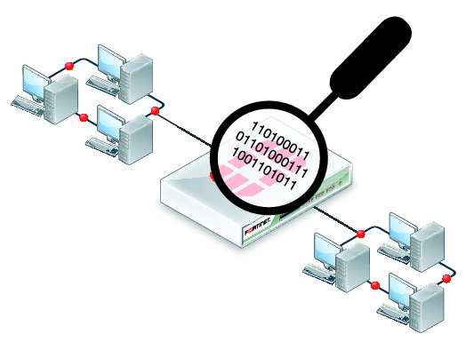

# PACKET-SNIFFER

# PYTHON RAW SOCKETS

This Packet sniffer has used python raw sockets to extract every detail from the network packet. 
The other sockets like stream sockets and datagram sockets recieve data from the transport layer that contains no header but only the payload. 
There would be no additional information like source IP and MAC address etc. That means the two machines communicating will only share data. 
While on other hand the RAW SOCKETS are quite different. A RAW SOCKET allows a application to directly access lower level protocols. The packet will be totally un-extracted.

# NETWORK PACKET AND PACKET SNIFFERS

* When an application sends the ***data*** into the network, the message or data passes through various ***NETWORK LAYER***.
* Each layer adds some meta data along with the actual ***payload***. And at last a network packet is formed.
* ***APPLICATION LAYER*** generates the actual payload. Which is then sent down the further layers.
* Then the payload is transfered down to the ***TRANSPORT LAYER***. This layer actually deals with **end to end** communication. It adds the further headers to the payload like PORT NO. of source and destination services.
* Then this payload is sent further down to the ***NETWORK LAYER***. This layer deals with ***host to host*** connection.  The network layer deals with creating ***IP datagrams***. It is created by adding further header into the data packet, like SOURCE IP AND DESTINATION IP.
* And at last the datagram is sent down to the ***DATA LINK lAYER***. This layer deals with ***HOP TO HOP*** connectivity. This layer adds the header into the datagram. Fields like Mac address of source and destination are added. At end a ***ethernet frame*** is created.
* This ethernet frame is further sent down to the ***PHYSICAL LAYER***, which basically deals with sending data to wire or wireless medium.
* By default a machine is configured only to accept the data which is meant to recieved by it. A machine would accept a packet if only if the destination address is same as that of the machine. This mode is basically called ***non-promiscuous*** mode. 
* A machine can be configured to capture every packet, by simply switching it into ***promiscuous*** mode.

